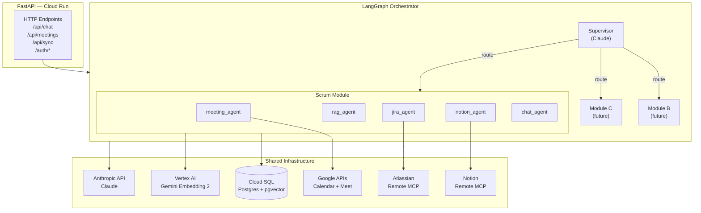
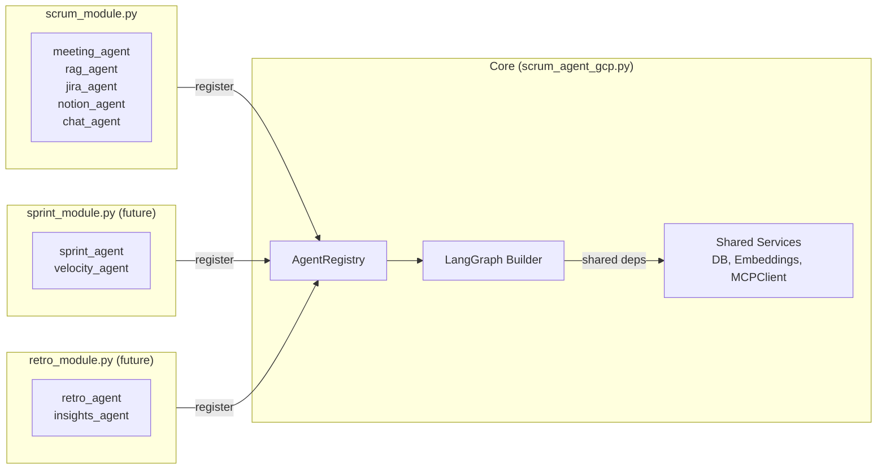

# Scrum Agent v2 — Design Document

**Date:** 2026-03-23
**Status:** Approved
**Scope:** RAG (Gemini Embedding 2) + LangGraph Orchestrator + MCP Clients (Jira + Notion) + Multi-module architecture

---

## 1. Контекст и цель

Базовая реализация `scrum_agent_gcp.py` (v1) покрывает:
- Google OAuth + Calendar sync
- Fetch транскриптов из Google Meet API
- Анализ через Claude: summary, action items, decisions
- Предложения апдейтов в Jira/Notion + ручное подтверждение
- Базовый чат (весь контекст в промпт, без RAG)

**v2 добавляет:**
1. RAG через Gemini Embedding 2 + pgvector
2. LangGraph Supervisor как верхнеуровневый оркестратор
3. Специализированные суб-агенты для scrum-модуля
4. Jira + Notion через официальные MCP-серверы
5. **Модульная архитектура** для параллельной разработки независимых модулей другими командами

---

## 2. Высокоуровневая архитектура



---

## 3. Модульная архитектура (для параллельной разработки)

### Проблема

Параллельно разрабатываются другие модули (например: sprint-planning agent, retrospective agent, standup bot и т.д.). Нужен способ:
- добавлять новые агенты без правки ядра
- изолировать код модулей друг от друга
- шарить общую инфраструктуру (DB, embeddings, MCP)
- автоматически регистрировать агентов в supervisor

### Решение: Module Registry Pattern



### AgentModule Protocol

Каждый модуль реализует один интерфейс:

```python
class AgentModule(Protocol):
    name: str           # уникальный ключ, используется supervisor для routing
    description: str    # supervisor читает это, чтобы решить когда роутить сюда
    version: str

    def get_node(self, services: SharedServices) -> Callable[[AgentState], AgentState]:
        """Возвращает LangGraph-совместимый node."""
        ...

    def get_system_prompt(self) -> str:
        """Системный промпт этого агента."""
        ...
```

### SharedServices — что шарится между модулями

```python
@dataclass
class SharedServices:
    db: Session                    # SQLAlchemy session factory
    embed: EmbeddingService        # Gemini Embedding 2
    jira_mcp: MCPClient            # Atlassian Remote MCP
    notion_mcp: MCPClient          # Notion Remote MCP
    llm: ChatAnthropic             # LangChain-обёртка над Claude
    user_id: str                   # текущий пользователь
```

### Как добавить новый модуль (инструкция для команды)

```python
# my_module.py
from core import AgentModule, SharedServices, AgentState

class SprintPlanningAgent:
    name = "sprint_planning_agent"
    description = "Handles sprint planning: velocity analysis, capacity, backlog grooming suggestions"
    version = "1.0.0"

    def get_node(self, services: SharedServices):
        tools = [...]  # свои инструменты
        agent = create_react_agent(services.llm, tools)

        def node(state: AgentState) -> AgentState:
            result = agent.invoke({"messages": state["messages"]})
            return {**state, "messages": result["messages"]}

        return node

# registration (в __init__.py модуля или через entry_points)
def register(registry):
    registry.add(SprintPlanningAgent())
```

### AgentRegistry и сборка графа

```python
class AgentRegistry:
    def __init__(self):
        self._modules: dict[str, AgentModule] = {}

    def add(self, module: AgentModule):
        self._modules[module.name] = module

    def build_graph(self, services: SharedServices) -> CompiledGraph:
        graph = StateGraph(AgentState)
        graph.add_node("supervisor", make_supervisor(self._modules, services.llm))

        for name, module in self._modules.items():
            graph.add_node(name, module.get_node(services))
            graph.add_edge(name, "supervisor")

        # Supervisor решает next через conditional edges
        graph.add_conditional_edges(
            "supervisor",
            lambda s: s["next_agent"],
            {name: name for name in self._modules} | {"END": END}
        )
        graph.set_entry_point("supervisor")
        return graph.compile()
```

---

## 4. LangGraph: AgentState и Supervisor

### AgentState

```python
class AgentState(TypedDict):
    messages:         Annotated[list[BaseMessage], add_messages]
    mode:             str                # "chat" | "pipeline"
    user_id:          str
    meeting_id:       Optional[str]
    next_agent:       str                # supervisor пишет сюда
    context:          dict               # промежуточные данные
    proposed_updates: list[dict]         # накапливаются агентами
    final_answer:     Optional[str]
```

### Supervisor prompt (шаблон)

```
You are the orchestrator for a Scrum AI assistant.
Available agents:
{agent_list_with_descriptions}

Current mode: {mode}
Current context: {context_summary}

Decide which agent to call next, or output END if the task is complete.
Return JSON: {"next_agent": "<name>|END", "reasoning": "..."}
```

### Режимы работы

| Режим | Типичный маршрут |
|-------|-----------------|
| `pipeline` (после встречи) | meeting_agent → rag_agent → jira_agent → notion_agent → END |
| `chat` (Q&A) | rag_agent → [jira_agent\|notion_agent] → chat_agent → END |

---

## 5. RAG: Gemini Embedding 2 + pgvector

### Модель

- **Model ID:** `gemini-embedding-exp-03-07` (Gemini Embedding 2)
- **Dimensions:** 3072
- **Task types:** `RETRIEVAL_DOCUMENT` при индексации, `RETRIEVAL_QUERY` при поиске
- **SDK:** `google-cloud-aiplatform` (Vertex AI)

### Схема

```sql
CREATE EXTENSION IF NOT EXISTS vector;

CREATE TABLE document_chunks (
    id          TEXT PRIMARY KEY DEFAULT gen_random_uuid()::text,
    user_id     TEXT NOT NULL,
    source_type TEXT NOT NULL,
    -- meeting_transcript | meeting_summary | action_item
    -- decision | jira_issue | notion_page
    source_id   TEXT NOT NULL,
    chunk_index INT  DEFAULT 0,
    chunk_text  TEXT NOT NULL,
    embedding   vector(3072),
    metadata    JSONB DEFAULT '{}',
    created_at  TIMESTAMPTZ DEFAULT now()
);

CREATE INDEX ON document_chunks
    USING ivfflat (embedding vector_cosine_ops)
    WITH (lists = 100);

CREATE INDEX ON document_chunks (user_id, source_type);
```

### Что и когда индексируется

| Источник | Триггер | Чанкинг |
|----------|---------|---------|
| Transcript | после meeting processing | 512 токенов, overlap 50 |
| Summary | после meeting processing | целиком |
| Action items | после meeting processing | каждый item = 1 чанк |
| Decisions | после meeting processing | каждое решение = 1 чанк |
| Jira issue | при jira_agent sync | title + description целиком |
| Notion page | при notion_agent sync | 512 токенов, overlap 50 |

### Search

```python
def rag_search(query: str, user_id: str, top_k: int = 5) -> list[dict]:
    q_emb = embed(query, task_type="RETRIEVAL_QUERY")
    rows = db.execute("""
        SELECT chunk_text, source_type, source_id, metadata,
               1 - (embedding <=> :qe) AS score
        FROM document_chunks
        WHERE user_id = :uid
        ORDER BY embedding <=> :qe
        LIMIT :k
    """, {"qe": q_emb, "uid": user_id, "k": top_k})
    return rows
```

---

## 6. MCP Clients

### Atlassian Remote MCP

- **Endpoint:** `https://mcp.atlassian.com/v1/sse`
- **Transport:** SSE (HTTP)
- **Auth:** Atlassian API Token

### Notion Remote MCP

- **Endpoint:** `https://mcp.notion.com/v1/sse` (или stdio через `npx @notionhq/notion-mcp-server`)
- **Auth:** Notion Integration Token

### LangGraph интеграция

```python
from langchain_mcp_adapters.tools import load_mcp_tools

# Загружаем при старте, кешируем как tool list
jira_tools  = await load_mcp_tools(jira_session)   # → LangChain BaseTool[]
notion_tools = await load_mcp_tools(notion_session) # → LangChain BaseTool[]

# Передаём в create_react_agent конкретного агента
jira_agent  = create_react_agent(llm, jira_tools)
notion_agent = create_react_agent(llm, notion_tools)
```

---

## 7. Структура файлов

```
scrum-agent/
├── scrum_agent_gcp.py          # точка входа: FastAPI + graph bootstrap + HTML
├── core.py                     # AgentRegistry, AgentState, SharedServices, LangGraph builder
├── rag.py                      # EmbeddingService, chunk, embed, search
├── mcp_clients.py              # Atlassian + Notion MCP client init
├── modules/
│   └── scrum/
│       ├── __init__.py         # register(registry) функция
│       ├── meeting_agent.py
│       ├── rag_agent.py
│       ├── jira_agent.py
│       ├── notion_agent.py
│       └── chat_agent.py
├── docs/
│   ├── plans/                  # implementation plans (этот файл)
│   └── specs/                  # product + architecture specs
├── requirements.txt
└── Dockerfile
```

> **Для новых модулей:** создать `modules/<module_name>/`, реализовать `AgentModule` protocol, добавить `register(registry)` в `__init__.py`, добавить импорт в `scrum_agent_gcp.py`.

---

## 8. Зависимости v2

```
# уже есть в v1
fastapi, uvicorn[standard], sqlalchemy, psycopg2-binary
google-auth, google-auth-oauthlib, google-api-python-client
anthropic, httpx

# новые
langgraph                   # StateGraph, supervisor
langchain-anthropic          # ChatAnthropic для LangGraph
langchain-core               # BaseTool, BaseMessage
langchain-mcp-adapters       # MCP tools → LangChain tools
mcp                          # MCP Python client
google-cloud-aiplatform      # Vertex AI / Gemini Embedding 2
pgvector                     # pgvector + SQLAlchemy
```

---

## 9. GCP: что нужно поднять

| Ресурс | Для чего |
|--------|---------|
| Cloud Run | основной сервис |
| Cloud SQL (Postgres 15+) | данные + pgvector |
| Vertex AI | Gemini Embedding 2 |
| Secret Manager | токены и secrets |
| Cloud Scheduler | автосинк календаря |
| Artifact Registry | docker images |

Подробный список API, IAM ролей и инструкций — в `docs/plans/2026-03-23-gcp-setup.md`.
