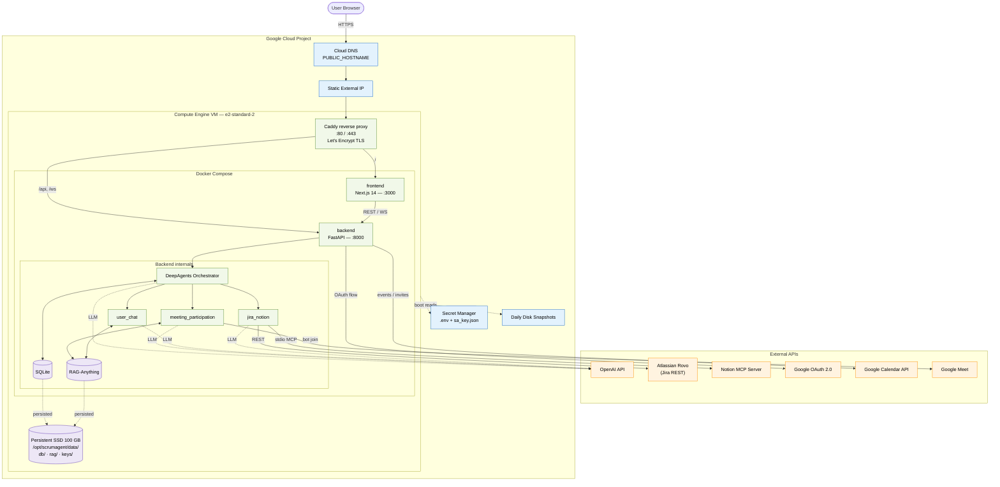

# GCP deployment topology

Connectivity diagram for the Google Cloud target: a single Compute Engine VM running the same Docker Compose stack as local dev, fronted by Caddy, talking to OpenAI / Atlassian Rovo / Notion MCP / Google Workspace externally. See [[domains/deployment]] for the provisioning details and [[decisions/2026-05-18-gcp-compute-engine-deployment]] for why this shape.

## Diagram

## Edge plane

Public traffic terminates on Caddy on the VM. Cloud DNS resolves `PUBLIC_HOSTNAME` to the reserved Static External IP attached to the VM; Caddy negotiates Let's Encrypt certificates on first boot and routes:

- `/` → `frontend:3000` (Next.js 14)
- `/api` and `/ws` → `backend:8000` (FastAPI)

Firewall rules expose only 80/443 to the internet; SSH (22) is reachable only through IAP. See [[domains/deployment]] §Firewall.

## In-VM service plane

`docker compose up` brings two containers:

- **frontend** — Next.js 14 App Router, talks to backend over REST/WS, never reaches external APIs directly. Boundary enforced in [[domains/architecture]].
- **backend** — single Python container with FastAPI router, the [[modules/runtime-orchestrator|DeepAgents orchestrator]], all three agents, [[modules/rag|RAG-Anything]], and embedded SQLite.

The three agents (`meeting_participation`, `user_chat`, `jira_notion`) never call each other directly — handoffs go through the orchestrator. See [[decisions/2026-03-27-three-agents-only]] and [[concepts/deepagents-runtime]].

## State plane

The persistent SSD (100 GB) is mounted at `/opt/scrumagent/data/` and is the only stateful artifact on the VM. Layout:

- `db/dev.db` — SQLite tables (`agent_runs`, `agent_steps`, meeting artifacts, users, settings). Source of truth for [[modules/trace-store]].
- `rag/` — RAG-Anything vector index + raw chunks ([[modules/rag]]).
- `keys/sa_key.json` — Google service account key for domain-wide delegation; written from Secret Manager at boot, never committed.

Daily Compute Engine snapshot of the whole disk is the recovery mechanism. Rollback = restore from snapshot.

## External integrations

| From | To | Transport | Purpose |
|------|-----|-----------|---------|
| Orchestrator + every agent | OpenAI API | `langchain-openai` HTTPS | LLM calls; only LLM vendor — see [[decisions/2026-03-27-openai-only-llm]] |
| `jira_notion` agent | [[entities/atlassian-rovo|Atlassian Rovo]] | REST (Rovo client) | Jira ops via [[modules/rovo-client]] |
| `jira_notion` agent | [[entities/notion|Notion]] MCP server | stdio MCP | Notion ops via [[modules/mcp-clients]] (Notion-only after Rovo migration) |
| `meeting_participation` agent | Google Meet | bot join via SA delegation | Live meeting attendance |
| backend (`routers/auth.py`) | Google OAuth 2.0 | OAuth code flow | User login; restricted to `@municorn.com` via [[flows/oauth-login]] |
| backend ([[modules/calendar-sync]]) | Google Calendar API | service account | Event reads / invites |

Frontend never talks to any external API directly — the boundary is enforced in [[domains/architecture]] §Boundaries.

## Control plane (GCP)

- **Secret Manager** holds `.env` payload and `sa_key.json`. VM startup script pulls them via `gcloud secrets versions access` and lands them on disk under `/opt/scrumagent/data/keys/`. VM service account is granted only `roles/secretmanager.secretAccessor` and `roles/logging.logWriter`.
- **Cloud DNS** + **Static External IP** keep the public hostname stable across VM rebuilds.
- **Disk snapshot schedule** runs nightly against the data SSD.

OAuth client registered for local dev gets a second authorized redirect URI for cloud: `https://${PUBLIC_HOSTNAME}/auth/google/callback`. Same `GOOGLE_CLIENT_ID` / `GOOGLE_CLIENT_SECRET` are reused.

## What this diagram does not show

- Internal FastAPI routers and module wiring — see [[domains/backend]].
- Step-level run flow for a single meeting — see [[flows/meeting-processing]].
- Chat retrieval pipeline — see [[flows/chat]].
- The local-only deployment variant — same containers, no Caddy/DNS/Secret Manager, data volume is `./data/` instead of the persistent SSD. See [[domains/deployment]] §Run locally.
